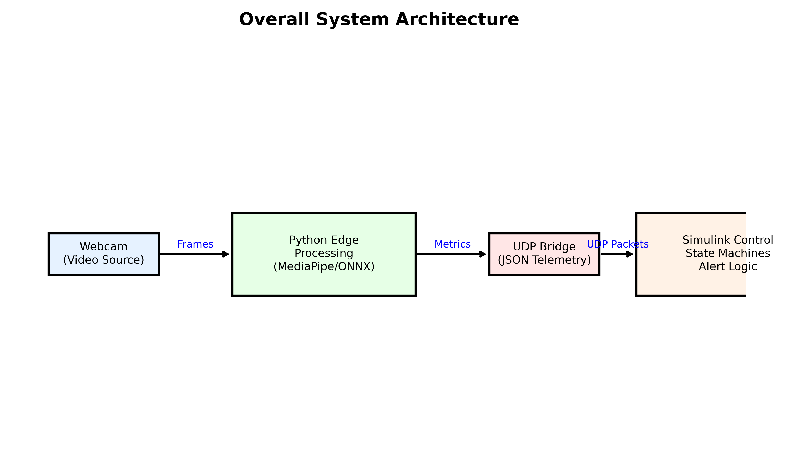

# AI-Based Driver Behavior Monitoring System

## Overview
This repository contains the prototype implementation of the AI-Based Driver Behavior Monitoring System, implemented in MATLAB/Simulink and Python. The system monitors the driver's face, eyes, and head pose to provide real-time alerts for drowsiness, distraction, and to verify driver identity.

**IMPORTANT:** This represents the MATLAB/Simulink + Python prototype implementation. This is **NOT** yet the Raspberry Pi deployment. The Raspberry Pi implementation will be done later as a separate development stage.

## Subsystems

1. **Section 1: Driver Drowsiness** (COMPLETE / VALIDATED)
   - Tracks Eye Aspect Ratio (EAR) and Mouth Aspect Ratio (MAR) to detect blinks, yawns, and prolonged drowsiness.
2. **Section 2: Driver Distraction** (COMPLETE / VALIDATED)
   - Evaluates 3D Head Pose (Yaw/Pitch) and gaze vectors to measure driver attention against the road center.
3. **Section 3: Driver Identification** (COMPLETE / VALIDATED)
   - Runs a lightweight ONNX SFace model to extract facial embeddings and ensure authorized operation.

## Results at a Glance

| Module | Status |
|---|---|
| Drowsiness | Complete / Validated |
| Distraction | Complete / Validated |
| Driver Identification | Complete / Validated |
| UDP Integration | Validated |
| Simulink Integration | Validated |
| Raspberry Pi Deployment | Future Work |

*For complete validation evidence, plots, and architecture diagrams, check the `Results/` and `Documentation/` directories.*

## Open-Source Video Evaluation

To ensure structural algorithm integrity against standardized behaviors, this system was evaluated offline against several datasets:
- **NTHU-DDD** & **YawDD** (Drowsiness)
- **Drive&Act** (Distraction)
- **LFW** (Identification)

*These are external open-source video evaluations and are not equivalent to a controlled real-world human-driver validation study.*

- **Licenses:** All datasets are utilized strictly under their respective Academic/Research Use and Open non-commercial licenses. Raw video clips are excluded from this repository in compliance with redistribution terms.
- **Reproduction:** Researchers can run `tests/video_evaluation/video_test_runner.py` with legally obtained local video files to reproduce the CSV logs and annotated results. 
- **Results:** Simulated algorithmic responses and generated plots are stored in `Results/TaskX_.../OpenSource_Tests/` and summarized in `Results/OpenSource_Test_Results.md`.

## Technology Stack
- **Languages:** MATLAB / Python 3.x
- **Libraries:** MediaPipe, OpenCV, ONNX Runtime, NumPy, Matplotlib
- **Simulation:** Simulink (UDP Data parsing, State Machines, Scopes)

## Usage
Refer to the individual `README.md` files in each section for specific execution and integration instructions.
