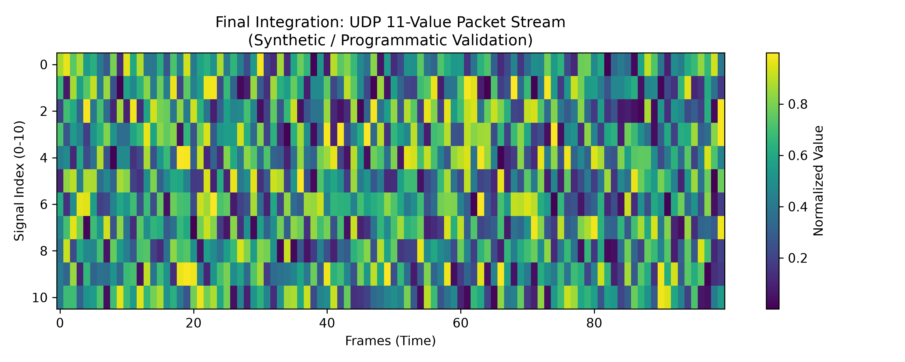

<div align="center">
  <h1>AI-Based Driver Behavior Monitoring</h1>
  <p><strong>A computer-vision safety system for real-time driver drowsiness, distraction, and identity verification.</strong></p>

  <!-- Badges -->
  <p>
    <a href="https://www.python.org/"></a>
    <a href="https://www.mathworks.com/products/matlab.html"></a>
    <a href="https://developers.google.com/mediapipe"></a>
    <a href="https://onnxruntime.ai/"></a>
  </p>
</div>

---

## 1. Project Overview

The **AI-Based Driver Behavior Monitoring System** is a software-in-the-loop (SIL) prototype designed to continuously analyze a driver's facial and head movements to detect unsafe conditions. By combining lightweight deep learning models (MediaPipe and ONNX SFace) with robust state-machine logic in MATLAB/Simulink, the system actively monitors drowsiness, visual distraction, and driver identity, bridging high-speed computer vision with deterministic control logic via a custom UDP telemetry protocol.

**Note:** This repository represents the completed PC-based SIL prototype. Deployment to edge hardware (Raspberry Pi) is slated as future work.

## 2. Problem / Motivation

Driver fatigue and inattention remain leading causes of traffic accidents. While modern vehicles increasingly feature advanced driver assistance systems (ADAS), there is a critical need for modular, computationally efficient pipelines that can process video at the edge without relying on cloud computation. This project was built to test whether extremely lightweight architectures (like MediaPipe FaceMesh) could reliably feed deterministic, time-filtered control systems in Simulink to avoid the false-positive alerts common in rudimentary vision systems.

## 3. What Is Implemented

The repository is modularized into three complete, independently executable subsystems, capped by a final integrated pipeline:

1. **Section 1 - Drowsiness:** Tracks Eye Aspect Ratio (EAR) and Mouth Aspect Ratio (MAR).
2. **Section 2 - Distraction:** Evaluates 3D Head Pose and Eye Gaze.
3. **Section 3 - Driver Identification:** Verifies driver authorization using facial embeddings.
4. **Final Integration:** Fuses all three vision pipelines into a single Python sender communicating with a master Simulink dashboard.

## 4. Key Features

- **Low-Latency Edge AI:** Uses MediaPipe Face Landmarker and OpenCV SFace (ONNX) for sub-50ms inference.
- **Deterministic State Machines:** 2-second temporal persistence filters in Simulink ensure alerts trigger only on genuine danger, ignoring quick blinks or shoulder checks.
- **Custom UDP Telemetry:** A highly efficient 88-byte (11 doubles) packet transmits spatial telemetry to Simulink at exactly 20 Hz.
- **Modular Architecture:** Any of the three vision tasks can be executed and tested completely independently.
- **Privacy-First Design:** Biometric databases store mathematical embeddings, not raw facial images.

## 5. Complete System Architecture


1. **Python Vision Node:** Captures webcam frames, extracts 468 3D facial landmarks, and computes Eulerian head pose angles and EAR/MAR metrics.
2. **Telemetry Bridge:** Variables are packed into an 11-value `struct` and broadcasted locally over UDP Port 5000.
3. **Simulink Control Node:** The `dsp.UDPReceiver` parses the byte stream into native MATLAB signals, passing them through temporal logic gates to trigger actionable alerts.

## 6. Technologies Used

- **Python 3.x:** OpenCV, MediaPipe (Face Landmarker), ONNX Runtime, NumPy, Socket/Struct (Networking).
- **MATLAB / Simulink:** DSP System Toolbox, Stateflow (Logic), Custom MATLAB System Objects.

## 7. Requirements

- Python 3.8+
- MATLAB R2023a+ (with Simulink and DSP System Toolbox)
- A standard USB Web Camera (minimum 30 FPS capability)

## 8. Installation

Clone the repository and install the Python dependencies:

```bash
git clone https://github.com/ankurchopde/AI-Based-Driver-Behavior-Monitoring.git
cd AI-Based-Driver-Behavior-Monitoring
pip install mediapipe opencv-python numpy onnxruntime
```

## 9. Quick Start (Integrated Pipeline)

To run the complete system (Drowsiness + Distraction + Identification):

1. **Start the Python Vision Node:**
   ```bash
   python FINAL_AI_Driver_Monitoring/Python/master_driver_monitor_udp.py
   ```
2. **Start the Simulink Dashboard:**
   - Open MATLAB.
   - Run the startup script to resolve dependencies:
     ```matlab
     cd Section3_Driver_Identification
     startup
     open_system('driver_monitor_sim_identification.slx')
     ```
   - Press the **Run** button in Simulink.

## 10. Complete Execution Workflow

The system can be executed modularly. Refer to the specific README files in each folder for deep-dive instructions on algorithms and isolated execution.

### 11. Section 1 - Drowsiness
Tracks eyelid closure (EAR < 0.20 for 2 seconds) and yawning (MAR > 0.60).
[📖 Read the Drowsiness Module Documentation](Section1_Drowsiness/README.md)

### 12. Section 2 - Distraction
Uses OpenCV `solvePnP` on the MediaPipe face mesh to track Head Pose (Yaw > 30° / Pitch > 20°).
[📖 Read the Distraction Module Documentation](Section2_Distraction/README.md)

### 13. Section 3 - Driver Identification
Uses an ONNX face recognizer to compare real-time embeddings against an enrolled local database, gated by a 0.363 cosine similarity threshold.
[📖 Read the Identification Module Documentation](Section3_Driver_Identification/README.md)

## 14. Final UDP / MATLAB / Simulink Integration

The master pipeline relies on a unified Simulink model (`driver_monitor_sim_identification.slx`) that multiplexes the logic from all three sections into a unified dashboard. A custom MATLAB System Object (`UDPReceiverSystemIdentification.m`) unpacks the raw byte array into 11 distinct signal lines.

## 15. UDP Protocol

The telemetry packet is strictly formatted to ensure robust deserialization in MATLAB:

| Field | Description | Type |
|---|---|---|
| 0 | Face Detected (1.0 or 0.0) | Double |
| 1 | Eye Aspect Ratio (EAR) | Double |
| 2 | Mouth Aspect Ratio (MAR) | Double |
| 3 | Yaw (Degrees) | Double |
| 4 | Pitch (Degrees) | Double |
| 5 | Roll (Degrees) | Double |
| 6 | Gaze X Vector | Double |
| 7 | Gaze Y Vector | Double |
| 8 | Driver ID (`-1.0` if unknown) | Double |
| 9 | Cosine Similarity Score | Double |
| 10 | Identity State Code | Double |

**Total Size:** 88 Bytes (`<11d`). Transmitted at exactly 20 Hz to Port 5000.

## 16. Results


*Above: Programmatic verification of the 11-value multiplexed UDP telemetry stream successfully parsing in Simulink.*

For a complete breakdown of algorithmic validation and qualitative testing on open-source datasets (NTHU-DDD, YawDD, Drive&Act), see the Results guide.
[📖 View the Full Results & Evidence Documentation](Results/README.md)

## 17. Reproducing Results

Researchers wishing to replicate the offline evaluations can run the included test utility against their own legally obtained copies of the benchmark datasets:
```bash
python tests/video_evaluation/video_test_runner.py --video path/to/dataset.mp4 --task integrated --out_dir Results/Custom_Test --prefix custom_test
```

## 18. Repository Structure

```text
AI-Based-Driver-Behavior-Monitoring/
├── FINAL_AI_Driver_Monitoring/    # Integrated master Python script
├── Section1_Drowsiness/           # Drowsiness logic and models
├── Section2_Distraction/          # Head pose, gaze, and spatial logic
├── Section3_Driver_Identification/# Face recognition, enrollment, and unified Simulink
├── Results/                       # Validation plots and dataset evaluations
├── Documentation/                 # Architectural diagrams and audits
└── tests/                         # Offline video evaluation utilities
```

## 19. Models / Dependencies

The repository includes the necessary lightweight models for offline execution:
- `face_landmarker.task`: Google MediaPipe Vision model.
- `fan2_68_landmark.onnx`: Optional fallback 68-point landmarker.
- `face_recognizer_fast.onnx`: OpenCV Zoo SFace extraction model.

## 20. Privacy / Biometric Data

This repository complies strictly with data privacy standards. The `database/` directory contains structural placeholders only. **No actual face images or biometric `embeddings.npy` files are included.** Users must manually enroll drivers on their local machine using `live_enrollment.py`.

## 21. Troubleshooting

- **Simulink Error: "System object cannot be found"**: You did not run `startup.m`. You must `cd Section3_Driver_Identification` and execute `startup` in the MATLAB console before opening the model to bind the cross-section dependencies.
- **Python ModuleNotFoundError**: Ensure you are running `master_driver_monitor_udp.py` from the root of the repository, as it dynamically binds paths to the Section directories.

## 22. Limitations

- **Physical Validation:** The current metrics are based strictly on Software-In-the-Loop (SIL) programmatic bounds checking and offline video dataset evaluation. Live edge-hardware (Raspberry Pi) and moving-vehicle validation remain outstanding.
- **Environment Variance:** The SFace cosine similarity threshold (`0.363`) is a prototype candidate value and has not been empirically proven against harsh automotive cabin lighting conditions (e.g., severe IR wash or direct sunlight).

## 23. Future Work

- Deployment to Raspberry Pi 4/5 using TFLite/ONNX edge acceleration.
- Integration with physical CAN-bus alerts (e.g., haptic seat vibrations or audible chimes) instead of Simulink software dashboard scopes.
- Night-vision (IR) camera validation.

## 24. References

- **MediaPipe:** Lugaresi, C., et al. (2019). MediaPipe: A Framework for Building Perception Pipelines. *arXiv*.
- **EAR Algorithm:** Soukupová, T., & Čech, J. (2016). Real-Time Eye Blink Detection using Facial Landmarks. *CVWW*.
- **SFace:** Zhong, Y., et al. (2021). SFace: Sigmoid-Constrained Hypersphere Loss for Robust Face Recognition. *IEEE TIP*.

## 25. Credits

- **Section 1 (Drowsiness):** “Architecture adapted from [Tanmaygt1]([https://github.com/Tanmaygt1](https://github.com/Tanmaygt1/Realtime-driver-drowsiness-detection)).

## 26. License

The original source code within this repository is open-sourced under the MIT License (see `LICENSE`). Note that included third-party models (MediaPipe, SFace) and utilized evaluation datasets (LFW, NTHU-DDD) are subject to their respective proprietary, academic, or non-commercial licenses.

## 27. Disclaimer

This software is an academic prototype intended for research purposes. It is **NOT** a certified automotive safety device. It should never be relied upon to control a vehicle or replace human attentiveness.
