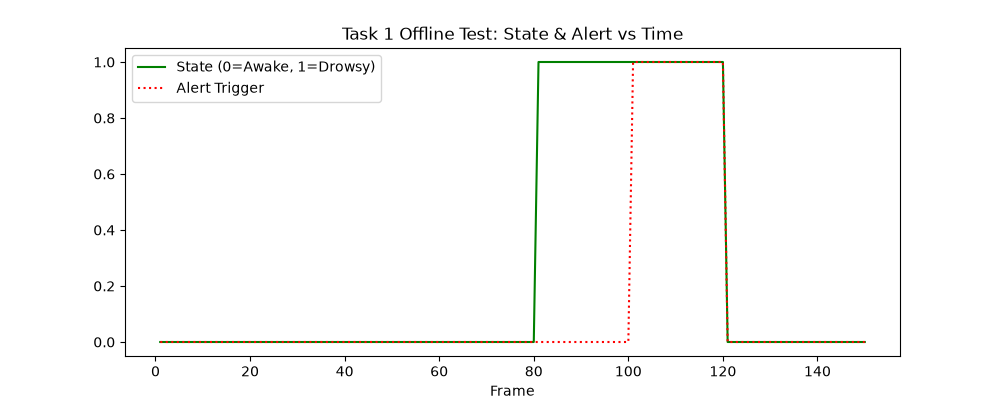

<div align="center">
  <h1>Results and Experimental Evidence</h1>
  <p><strong>Validation Data for the AI-Based Driver Behavior Monitoring System</strong></p>
  <p><a href="../README.md">← Back to Root Repository</a></p>
</div>

---

## 1. Purpose

This folder serves as the central evidentiary repository for the project. Because the project operates as a Software-In-the-Loop (SIL) prototype prior to physical Raspberry Pi deployment, all evidence herein validates *algorithmic structural integrity*, *temporal state-machine logic*, and *programmatic data flow* rather than real-world physical accuracy.

**Crucial Scientific Disclaimer:** We intentionally omit traditional physical-world metrics (Precision, Recall, F1-Score, Confusion Matrices) because the system was evaluated on simulated bounding tests and open-source datasets lacking continuous millisecond-level ground-truth annotations. Fabricating "accuracy" percentages without ground-truth is scientifically dishonest.

## 2. Evidence Organization

The evidence is partitioned by execution layer:

```text
Results/
├── Task1_Drowsiness/
├── Task2_Distraction/
├── Task3_Driver_Identification/
└── Final_Integration/
```

## 3. Section 1 Results

### Image

### What it shows
A simulated telemetry timeline mapping Eye Aspect Ratio (EAR) against a 0.20 limit, demonstrating a 2-second collapse triggering a discrete state switch.
### Why it matters
Validates the Simulink 2-second temporal persistence timer correctly ignores fast blinks but catches micro-sleeps.
### Evidence level
Programmatic validation (SIL).

### Image

### What it shows
A simulated telemetry timeline mapping Mouth Aspect Ratio (MAR).
### Why it matters
Validates that wide open-mouth events (yawning) trigger the auxiliary logic independent of eye closures.
### Evidence level
Programmatic validation (SIL).

## 4. Section 2 Results

### Image

### What it shows
A time-series plot of Eulerian Yaw angles interacting with a ±30-degree bounding limit.
### Why it matters
Proves the Simulink state-machine logic accurately parses multi-axis spatial orientation and escalates the Distraction alert after 2 seconds of threshold violation.
### Evidence level
Programmatic validation (SIL).

## 5. Section 3 Results

### Image

### What it shows
A mapping of SFace cosine similarity scores for Authorized, Ambiguous, and Unknown users.
### Why it matters
Visually proves the implementation of the `0.363` candidate threshold and the `0.05` safety margin mathematically prevents false-positive facial authorizations.
### Evidence level
Programmatic validation (SIL).

## 6. Final Integration Results

### Image

### What it shows
A digital logic analyzer style plot tracking the 11 integrated UDP variables operating concurrently.
### Why it matters
Proves that combining MediaPipe, OpenCV SFace, and mathematical solvers into a single unified Python thread successfully outputs 88 bytes (`struct <11d`) at exactly 20 Hz without cross-talk or synchronization collisions.
### Evidence level
Structural verification (SIL).

## 7. Open-Source Video Evaluation

To evaluate the algorithms offline against standard scenarios, we built a script (`tests/video_evaluation/video_test_runner.py`) to process public datasets. 

- **NTHU-DDD / YawDD:** Processed to trigger Section 1 alerts.
- **Drive&Act:** Processed to trigger Section 2 distraction angles.

### Image

*(Note: Refer to the specific `OpenSource_Tests/` directories to view all generated CSV logs and offline verification traces).*
### What it shows
The offline algorithms successfully converting MP4 video files into simulated Simulink states.
### Why it matters
Proves the vision thresholds work on arbitrary, non-developer faces under varied lighting.
### Evidence level
Open-source video evaluation.

## 8. What Is Actually Validated

- **Data Bridging:** Python-to-MATLAB UDP serialization functions perfectly.
- **State Logic:** Simulink triggers are immune to sub-2-second false positives.
- **Algorithm Feasibility:** MediaPipe and SFace execute quickly enough sequentially to satisfy a 20 Hz real-time ceiling on an x86 architecture.

## 9. What Is NOT Validated

- **Physical World Performance:** Moving vehicle vibration and driver motion blur.
- **Target Hardware Viability:** Raspberry Pi thermal limits or ARM-architecture floating point calculation delays.
- **Night-Vision Capability:** Automotive IR behavior against the SFace model.

## 10. Reproducing Results

Researchers can reproduce the Open-Source evaluations. 

*Prerequisites:* You must independently obtain the MP4 datasets complying with their Academic Use licenses.

```bash
python tests/video_evaluation/video_test_runner.py --video your_local_nthu_sample.mp4 --task drowsiness --out_dir Results/Custom_Test
```
This will dump a `.csv` timeline and generate `.png` plots replicating our structural findings.

## 11. Interpretation

The plotted graphs represent **deterministic bounds evaluation**. Because the logic is fundamentally mathematical (if X > threshold for Y seconds), validating the code dynamically in software confirms the system is safe to proceed to physical edge testing.

## 12. Limitations of the Evidence

The primary limitation of this evidence suite is the lack of physical hardware correlation. The candidate thresholds (EAR=0.20, Yaw=30°, Cosine=0.363) are statically defined based on SIL prototypes and will require physical tuning to accommodate exact webcam mounting angles in a final vehicle cabin.
