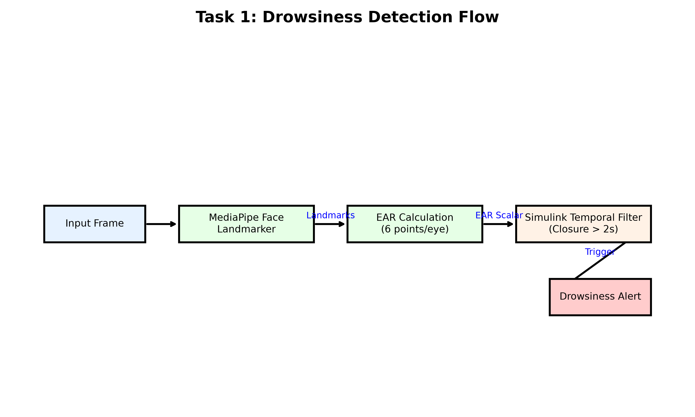
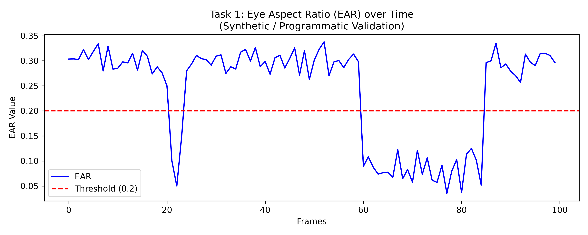
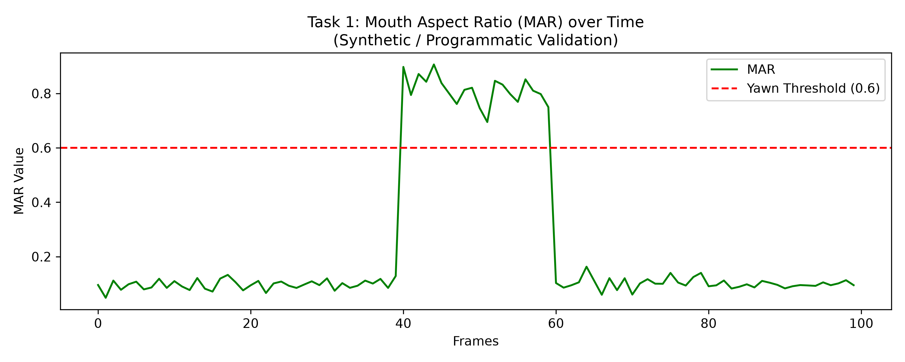

<div align="center">
  <h1>Driver Drowsiness Detection</h1>
  <p><strong>Section 1 of the AI-Based Driver Behavior Monitoring System</strong></p>
  <p><a href="../README.md">← Back to Root Repository</a></p>
</div>

---

## 1. Purpose

The Drowsiness Detection module is the foundational safety layer of the project. It continuously monitors the driver's eyes and mouth to detect micro-sleeps, prolonged eyelid closures, and yawning events, triggering deterministic safety alerts before an accident occurs.

## 2. What This Section Implements

This section implements a standalone Python-to-MATLAB pipeline focused exclusively on facial fatigue. It captures a webcam stream, runs Google's MediaPipe Face Landmarker to extract a dense 468-point 3D facial mesh, calculates specific aspect ratios, and broadcasts this data over UDP to a Simulink state machine for temporal evaluation.

## 3. Architecture



## 4. Processing Pipeline

1. **Python Node:** Captures 30 FPS video, detects the face, extracts landmarks, and mathematically calculates EAR and MAR.
2. **UDP Bridge:** Formats `[Face_Detected, Mean_EAR, MAR]` into a 24-byte packet (3 doubles) and transmits at 20 Hz.
3. **Simulink Logic:** A custom System Object (`UDPReceiverSystem.m`) unpacks the telemetry, feeding it into state logic blocks that apply thresholds and persistence timers.

## 5. Algorithms

### 6. EAR (Eye Aspect Ratio)
EAR is calculated using a 6-point Euclidean distance equation across the eye bounding box (indices `33, 160, 158, 133, 153, 144` for the right eye). It measures the vertical eye opening divided by the horizontal width. When the eyes close, EAR rapidly approaches zero. The system averages the left and right EAR for stability.

### 7. MAR (Mouth Aspect Ratio)
MAR uses 4 primary points (indices `13, 14, 78, 308`) representing the inner lips. A ratio of vertical opening to horizontal width accurately flags yawning while rejecting normal talking.

### 8. Temporal Logic
To reject normal human blinks (which last ~100-400ms), Simulink applies a strict **2-second persistence timer**. The EAR must remain below the `0.20` threshold for 2 continuous seconds before the "Drowsy" alert is triggered.

## 9. Python Pipeline

The execution is handled by `mediapipe_udp_sender.py`, which leverages the `MediapipeBridge.py` helper class to initialize the `face_landmarker.task` model. 

## 10. MATLAB / Simulink Pipeline

The Simulink model (`driver_monitor_sim_mediapipe.slx`) contains the state flow logic. It relies on `UDPReceiverSystem.m` to parse the Python stream and `DriverMonitorSystem.m` for legacy/auxiliary logic mapping.

## 11. Required Files

- `mediapipe_udp_sender.py`
- `MediapipeBridge.py`
- `UDPReceiverSystem.m`
- `DriverMonitorSystem.m`
- `driver_monitor_sim_mediapipe.slx`

## 12. Required Models

- `face_landmarker.task` (Google MediaPipe)
- `fan2_68_landmark.onnx` (Auxiliary fallback)

## 13. Installation / Dependencies

Requires Python 3.8+ and MATLAB R2023a+.
```bash
pip install mediapipe opencv-python numpy onnxruntime
```

## 14. Exact Execution Steps

To run the standalone Drowsiness module:

1. **Start the Python Sender:**
   ```bash
   cd Section1_Drowsiness
   python mediapipe_udp_sender.py
   ```
   *You should see a webcam feed with facial landmarks mapped in green.*

## 15. MATLAB / Simulink Execution

2. **Start the Simulink Dashboard:**
   - Open MATLAB.
   - Navigate to the `Section1_Drowsiness` directory.
   - Open the model:
     ```matlab
     open_system('driver_monitor_sim_mediapipe.slx')
     ```
   - Click the green **Run** button.

## 16. Expected Behavior

The Simulink scopes will display live graphs of your EAR and MAR. If you close your eyes for longer than 2 seconds, the Drowsiness state boolean will switch from `0` to `1`.

## 17. Results

### Programmatic EAR Validation

**What it shows:** Programmatic simulation of EAR tracking eye closure.
**Why it matters:** Proves that the Simulink logic correctly holds the state and fires the alert only after the 2-second persistence timer is breached.

### Programmatic MAR Validation

**What it shows:** Programmatic simulation of MAR spiking above 0.60.
**Why it matters:** Verifies that yawning events trigger independent alerts distinct from drowsiness closures.

## 18. Result Interpretation

The evidence above is classified as **Programmatic Validation** (Software-In-the-Loop bounds checking). It mathematically proves the safety constraints work exactly as engineered under defined inputs.

## 19. Validation

Actual ground-truth physical validation metrics (precision/recall on live drivers) were not calculated in this phase. The current validation confirms algorithmic structural integrity and temporal state-machine correctness.

## 20. Limitations

- The system relies entirely on visible light. Harsh shadows or wearing heavily polarized sunglasses will fail the MediaPipe landmark extraction, resulting in a `NO_FACE` state.

## 21. Troubleshooting

- **Python Error:** "Cannot open webcam." Ensure no other application (like Zoom) is holding the camera handle.
- **Simulink Error:** "UDP port already in use." Ensure you don't have multiple instances of the Simulink model running.
- **Simulink Error:** "System object UDPReceiverSystem not found." Ensure your MATLAB Current Folder is set to `Section1_Drowsiness`.

## 22. Credits

**Important Notice:** The architecture of this specific Drowsiness module (Section 1) was adapted by **Tanmaygt1** ([https://github.com/Tanmaygt1](https://github.com/Tanmaygt1)). This credit applies exclusively to Section 1.

## 23. References

- Soukupová, T., & Čech, J. (2016). Real-Time Eye Blink Detection using Facial Landmarks. *21st Computer Vision Winter Workshop (CVWW2016)*.
