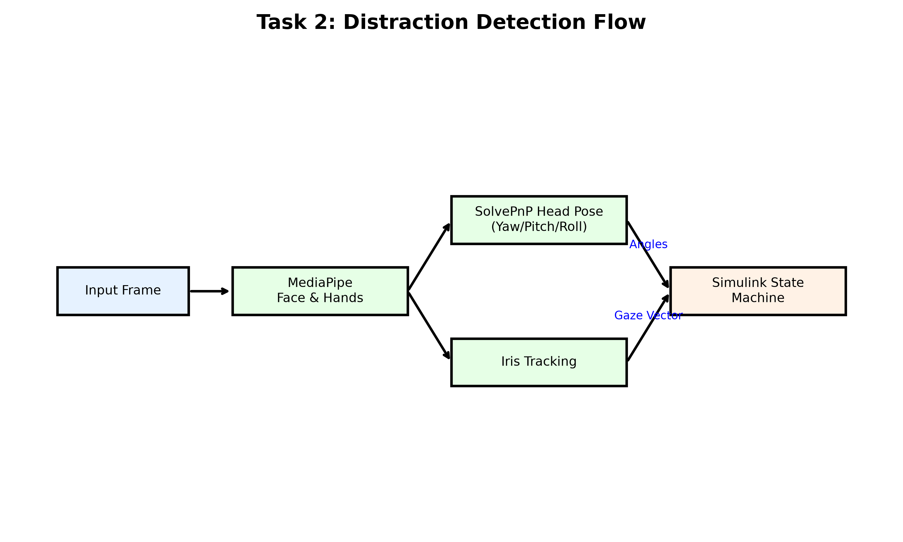
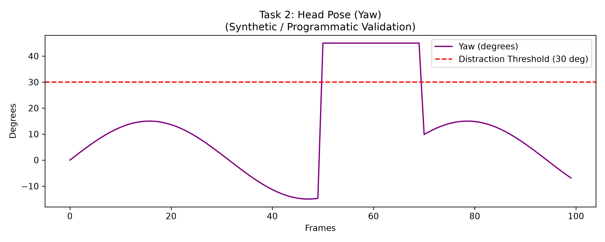

<div align="center">
  <h1>Driver Distraction / Attention Detection</h1>
  <p><strong>Section 2 of the AI-Based Driver Behavior Monitoring System</strong></p>
  <p><a href="../README.md">← Back to Root Repository</a></p>
</div>

---

## 1. Purpose

The Distraction Detection module extends the system's spatial awareness. Rather than just analyzing eye closures, this module tracks exactly where the driver's head and eyes are pointing. It is engineered to detect cognitive and visual distraction, such as looking down at a phone or turning to talk to a passenger, warning the driver to return their attention to the road.

## 2. What This Section Implements

This section implements a spatial computer vision pipeline that calculates 3D Eulerian head pose angles (Yaw, Pitch, Roll) and 2D eye gaze vectors. These metrics are transmitted over UDP to Simulink, which evaluates them against defined spatial boundaries to determine the driver's state of attention.

## 3. Architecture



## 4. Processing Pipeline

1. **Python Vision:** MediaPipe extracts facial landmarks. OpenCV calculates the head's rotation relative to the camera.
2. **UDP Packaging:** `[Face_Detected, EAR, MAR, YAW, PITCH, ROLL, GAZE_X, GAZE_Y]` is packed into 64 bytes (8 doubles).
3. **Simulink Routing:** `UDPReceiverSystemDistraction.m` intercepts the packet and routes spatial data to the `DistractionLogicSystem.m` state machine.

## 5. Head Pose

The script `head_pose.py` uses the standard OpenCV `cv2.solvePnP` function. It maps 6 critical 2D facial landmarks (nose tip, chin, eye corners, mouth corners) extracted by MediaPipe against a standardized 3D canonical face model. The resulting rotation vector is converted to Eulerian degrees (Yaw, Pitch, Roll).

## 6. Eye Gaze

The script `gaze_diagnostic.py` calculates relative pupil positioning. By tracking the distance of the iris center relative to the inner, outer, top, and bottom eye corners, it generates a normalized `Gaze_X` and `Gaze_Y` vector to determine if the driver is glancing sideways without moving their head.

## 7. Attention / Distraction Logic

Simulink evaluates the angles against strict thresholds:
- **Yaw Threshold:** > 30° or < -30° (Looking left/right out the window).
- **Pitch Threshold:** > 20° or < -20° (Looking down at phone / up at mirror).

## 8. Temporal Logic

To prevent false alarms from legitimate driving behavior (like quickly checking a blind spot or rear-view mirror), Simulink utilizes a **2-second temporal persistence timer**. The driver must exceed the 30° Yaw or 20° Pitch boundary for two continuous seconds before the system escalates to a "DISTRACTED" alert state.

## 9. Python Pipeline

Executed via `mediapipe_udp_sender.py`, utilizing `head_pose.py` and `gaze_diagnostic.py` as auxiliary mathematical solvers.

## 10. UDP Communication

Transmits to Port 5000 at ~20 Hz. Ensure Section 1 is not simultaneously running, as they share the same port in their standalone configurations.

## 11. MATLAB / Simulink Integration

The final Simulink model (`driver_monitor_sim_distraction.slx`) manages the temporal logic and dashboard plotting.

## 12. Required Files

- `mediapipe_udp_sender.py`
- `head_pose.py`
- `gaze_diagnostic.py`
- `UDPReceiverSystemDistraction.m`
- `DistractionLogicSystem.m`
- `SteeringWheelDashboard.m`
- `driver_monitor_sim_distraction.slx`

## 13. Required Models

- `face_landmarker.task`
- `hand_landmarker.task`
- `fan2_68_landmark.onnx`

## 14. Dependencies

Requires Python 3.8+ and MATLAB R2023a+.
```bash
pip install mediapipe opencv-python numpy onnxruntime
```

## 15. Exact Execution Steps

To run the standalone Distraction module:

1. **Start the Python Vision Node:**
   ```bash
   cd Section2_Distraction
   python mediapipe_udp_sender.py
   ```

## 16. Simulink Execution

2. **Start the Dashboard:**
   - Open MATLAB.
   - Navigate to the `Section2_Distraction` directory.
   - Open the model:
     ```matlab
     open_system('driver_monitor_sim_distraction.slx')
     ```
   - Click **Run**.

## 17. Expected Output

You will see live scopes tracking your Eulerian angles. Turning your head away from the camera for two seconds will trigger the red DISTRACTION warning.

## 18. Results

### Programmatic Head Pose Validation


**What it shows:** Programmatic simulation tracking Yaw angles against the system's threshold.
**Why it matters:** Validates that the Simulink logic strictly adheres to the 30° boundary and fires alerts correctly based on Eulerian inputs.
**Evidence level:** Programmatic validation (SIL verification).

## 19. Validation

Actual ground-truth physical validation metrics (e.g., degree of precision in moving vehicles) are not reported, as this is an offline Software-In-the-Loop evaluation.

## 20. Troubleshooting

- **Simulink Error: "The System object name 'DistractionLogicSystem' cannot be found."**
  - **Resolution:** This occurs if MATLAB is searching the wrong path. Ensure your MATLAB "Current Folder" is exactly set to `Section2_Distraction` before opening the `.slx` file, or right-click the folder in MATLAB and select "Add to Path > Selected Folders".

## 21. Limitations

- Extreme head turns (Yaw > 75°) will cause MediaPipe to lose tracking of the occluded far-side eye, forcing the pipeline into a `NO_FACE` failsafe state rather than calculating a raw angle.

## 22. References

- **SolvePnP:** OpenCV Documentation on 3D Pose Estimation.
- **MediaPipe:** Lugaresi, C., et al. (2019). MediaPipe: A Framework for Building Perception Pipelines. *arXiv*.
