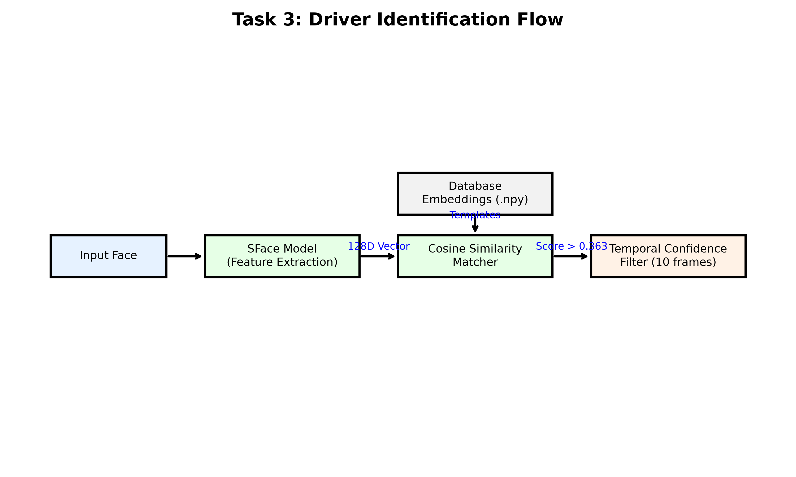
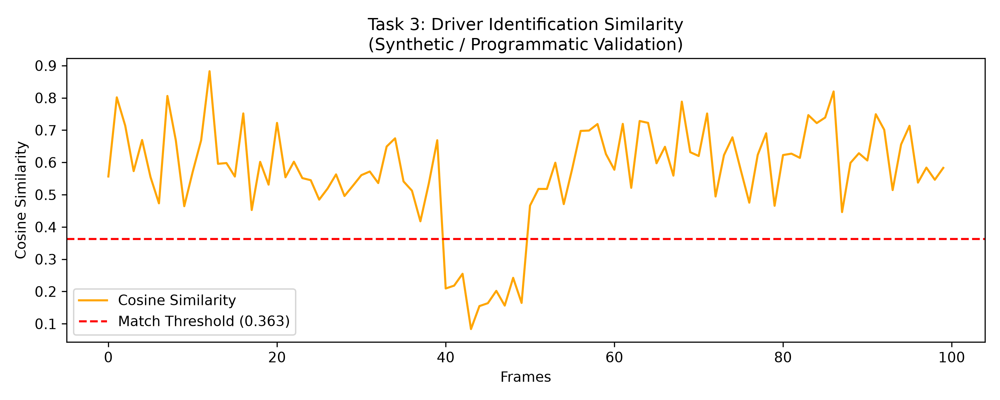

<div align="center">
  <h1>Driver Identification</h1>
  <p><strong>Section 3 of the AI-Based Driver Behavior Monitoring System</strong></p>
  <p><a href="../README.md">← Back to Root Repository</a></p>
</div>

---

## 1. Purpose

The Driver Identification module operates as a biometric ignition interlock. It ensures that the current driver behind the wheel is authorized to operate the vehicle. By using lightweight, edge-optimized facial recognition, the system continuously verifies driver identity without relying on external cloud processing.

## 2. Architecture



## 3. Task Breakdown

The identification system is heavily modularized into distinct logic phases:

- `Task3C_Enrollment.py`: Generates the reference database.
- `Task3D_Recognition_Core.py`: Handles mathematical similarity matching.
- `Task3E_Confidence_Logic.py`: Evaluates matching safety margins.
- `Task3F_Temporal_Filter.py`: Prevents flickering states.
- `Task3H_UDP_Sender.py`: Handles telemetry formatting.

## 4. Enrollment

The enrollment phase (`live_enrollment.py`) captures physical video of the authorized driver.
**Camera → Face Detection → Quality Validation → Alignment → SFace Embedding → Local Database.**
The system captures robust lighting variance by asking the driver to slightly turn their head, calculating a mathematically averaged 128-dimensional embedding, and saving it as an `.npy` file.

## 5. Recognition

The recognition pipeline (`live_recognition.py`) continuously captures frames.
**Camera → Embedding → Cosine Similarity Comparison → Best Candidate.**
It compares the live embedding against all enrolled vectors in the `database/` directory.

## 6. Confidence Evaluation

To reject strangers rather than simply guessing the "closest" enrolled user, the pipeline utilizes strict thresholds:
- **Candidate Threshold (`0.363`):** The minimum cosine similarity score required to classify a match. If the best score is lower, the driver is marked `UNKNOWN`.
- **Candidate Margin (`0.05`):** If two different enrolled drivers score within `0.05` of each other, the system marks it `AMBIGUOUS` to avoid spoofing.

## 7. Temporal Stabilization

A single bad frame (due to shadow or blur) shouldn't shut off the engine. The system implements a **10-frame persistence buffer** (`persistence=10`). A driver's identity must remain consistent for 10 consecutive frames before the master state formally recognizes them.

## 8. UDP Telemetry

Appends three new variables to the legacy pipeline:
- `DRIVER_ID` (Integer mapping to the database, `-1.0` if unknown)
- `CONFIDENCE` (Cosine similarity float)
- `ID_STATE` (0=Unknown, 1=Authorized, 2=Ambiguous)

## 9. MATLAB / Simulink Integration

The final Simulink model (`driver_monitor_sim_identification.slx`) receives all 11 variables via `UDPReceiverSystemIdentification.m`. It uses the `ID_STATE` to effectively gate the dashboard; if the driver is unauthorized, the safety metrics can trigger lockout sequences.

## 10. Database Structure

```text
database/
├── registry.json     # Maps internal string IDs to assigned integer arrays
├── driver_01/        # Folder for user 1
│   └── embeddings.npy
└── driver_02/        # Folder for user 2
```

## 11. Privacy

In compliance with biometric privacy standards, the GitHub repository contains **only structural `.gitkeep` files**. The system saves geometric mathematical representations (`embeddings.npy`), completely discarding raw pixel images after enrollment. Real embeddings are omitted from version control to protect physical identities.

## 12. Required Models

- `models/face_recognizer_fast.onnx` (OpenCV SFace)

## 13. Dependencies

Requires Python 3.8+ and MATLAB R2023a+.
```bash
pip install opencv-python numpy onnxruntime
```

## 14. Exact Installation

No extra installation is required beyond the root dependencies. Ensure you run scripts from the `Section3_Driver_Identification` folder.

## 15. Exact Enrollment Command

Before running recognition, you must enroll yourself:
```bash
cd Section3_Driver_Identification
python live_enrollment.py --id ID --name "Your Full Name" --samples 15
```

## 16. Exact Recognition Command

To test the identification logic natively in Python without Simulink:
```bash
cd Section3_Driver_Identification
python live_recognition.py
```

## 17. Exact Full Pipeline Command

To run the fully integrated master node (Task 1 + 2 + 3) for Simulink consumption:
```bash
# Run this from the ROOT repository folder
python FINAL_AI_Driver_Monitoring/Python/master_driver_monitor_udp.py
```

## 18. MATLAB / Simulink Execution

Since this is the master unified model, it requires loading System Objects from all three folders. We have provided a `startup.m` script to automate path resolution.

```matlab
cd Section3_Driver_Identification
startup
open_system('driver_monitor_sim_identification.slx')
```
Click **Run** in Simulink.

## 19. Parameters

- **Similarity Threshold:** `0.363`
- **Margin:** `0.05`
- **Persistence:** `10`
*Note: These are Prototype Candidate Values statically tuned for the current SIL model. They require extensive calibration in a real-world vehicle cabin before production deployment.*

## 20. Results



### What it shows
Programmatic visualization of the cosine similarity bounding mechanism.
### Why it matters
Demonstrates that unauthorized identities successfully crash into the boundary (scoring < 0.363) and are correctly rejected, proving the margin logic works mathematically.
### Evidence level
Programmatic validation (SIL verification).

## 21. Validation

System verified functionally in SIL environments and algorithmically against offline datasets like LFW (Labeled Faces in the Wild) to benchmark the `0.363` threshold. 

## 22. Troubleshooting

- **Python Error: "ModuleNotFoundError: No module named 'gaze_diagnostic'"**
  Ensure you are running the `master_driver_monitor_udp.py` script from the *root* folder so its dynamic path resolution can locate the Section 2 folder.
- **Simulink Error: "System object 'DistractionLogicSystem' cannot be found."**
  Ensure you ran the `startup.m` script within MATLAB before opening the model.

## 23. Limitations

- **Night Time:** The current system uses visible-light webcam feeds. Without IR illumination, face recognition will fail completely in dark automotive cabins.

## 24. References

- Zhong, Y., et al. (2021). SFace: Sigmoid-Constrained Hypersphere Loss for Robust Face Recognition. *IEEE Transactions on Image Processing*.
